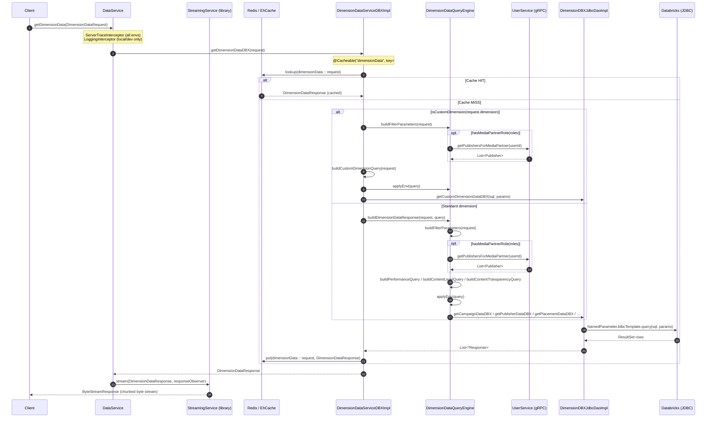

# Endpoint Flow: DataService/getDimensionData

## Flow Summary

The `getDimensionData` RPC is the primary gRPC endpoint for fetching dimension-level reporting data (campaigns, placements, publishers, ad sizes, DSP deals, and custom dimensions) from a Databricks data warehouse. A client sends a `DimensionDataRequest` proto message; the handler immediately delegates to `DimensionDataServiceDBXImpl`, which checks a Redis cache (key = the full request proto; TTL 10 min in Redis, 360 min in EhCache fallback). On a cache miss it inspects the dimension type — custom dimensions follow a separate code path that includes a custom-dimension join table and requires an `ultimateAdvertiserId`, while standard dimensions are routed through `DimensionDataQueryEngine`, which dynamically builds a SQL query against Databricks views. If the caller holds a media-partner role, the engine makes a synchronous outbound gRPC call to `UserService/getPublishersForMediaPartner` to obtain a publisher-id allowlist before executing the query. The built SQL is executed via a `NamedParameterJdbcTemplate` backed by a dedicated HikariCP pool (`databricks-cp`), the results are mapped to proto response objects, and the `StreamingService` from the internal `fantastic-signals-library` serialises the `DimensionDataResponse` as a byte-stream back to the caller.

## Call Chain

```
1. gRPC DataService/getDimensionData          →  DataService.getDimensionData()
2. DataService                                →  StreamingService.stream(...)                      [internal library: serialises DimensionDataResponse to ByteStreamResponse]
3. DataService                                →  DimensionDataServiceDBXImpl.getDimensionDataDBX() [@Cacheable("dimensionData", key=#request) — Redis/EhCache]

-- Standard dimension path --
4a. DimensionDataServiceDBXImpl              →  DimensionDataQueryEngine.buildDimensionDataResponse(request, query)
5a. DimensionDataQueryEngine                 →  DimensionDataQueryEngine.buildFilterParameters(request)
5b. DimensionDataQueryEngine (media partner) →  UserServiceClientImpl.getPublishersForMediaPartner()  [gRPC: UserService/getPublishersForMediaPartner]
5c. DimensionDataQueryEngine                 →  DimensionQueryBuilderDBX.build()                   [builds parameterised SQL]
5d. DimensionDataQueryEngine                 →  DimensionDataQueryEngine.applyEnv(query)
6a. DimensionDataQueryEngine                 →  DimensionDBXJdbcDaoImpl.getCampaignDataDBX() / getPublisherDataDBX() / getPlacementDataDBX() / getAdSizeDataDBX() / getDspDealDataDBX()
7a. DimensionDBXJdbcDaoImpl                  →  NamedParameterJdbcTemplate.query()                 [DB READ: reportingplatform_<env>.external_aggs.agg_agency_custom_daily_fs]

-- Custom dimension path --
4b. DimensionDataServiceDBXImpl              →  DimensionDataServiceDBXImpl.buildCustomDimensionResponse(request)
5e. DimensionDataServiceDBXImpl              →  DimensionDataQueryEngine.buildFilterParameters(request)
5f. DimensionDataQueryEngine (media partner) →  UserServiceClientImpl.getPublishersForMediaPartner()  [gRPC — conditional on role]
5g. DimensionDataServiceDBXImpl              →  DimensionQueryBuilderDBX.fromBare().addJoins().build()
5h. DimensionDataServiceDBXImpl              →  DimensionDataQueryEngine.applyEnv(query)
6b. DimensionDataServiceDBXImpl              →  DimensionDBXJdbcDaoImpl.getCustomDimensionDataDBX()
7b. DimensionDBXJdbcDaoImpl                  →  NamedParameterJdbcTemplate.query()                 [DB READ: reportingplatform_<env>.external_aggs.udtf_agg_agency_custom_daily]
```

## DB Tables

| Table | Operation | Key Columns / Notes |
|-------|-----------|---------------------|
| `reportingplatform_<env>.external_aggs.agg_agency_custom_daily_fs` | READ | `team_id`, `hit_date` range; dimension columns; metric aggregations; standard performance path via `fromView()` |
| `reportingplatform_<env>.LOOKER_SCRATCH.UDTF_AGG_CONTENT_LEVEL_REPORT_VIEW2` | READ | UDTF called with `(teamIds, startDate, endDate)`; used when `reportType=contentLevelReport` |
| `reportingplatform_<env>.external_aggs.udtf_agg_agency_custom_daily` | READ | Bare table + LEFT JOINs; `team_id`, `hit_date`, `ultimateAdvertiserId`, `custDim`; custom dimension path |
| `reportingplatform_<env>.prog_reporting.ctv_content_transparency_filter` | READ | `team_id`, `hit_date`, `ultimateAdvertiserId`; used when `reportType=contentTransparencyReport` |

> `<env>` is substituted at runtime from the `spring.datasource.databricks.envRead` config property via `DimensionDataQueryEngine.applyEnv()`.

## External Dependencies

| System | Type | Details |
|--------|------|---------|
| Databricks (JDBC) | Database | `NamedParameterJdbcTemplate` via HikariCP pool `databricks-cp` (max 50 connections, 60 s connection timeout); all dimension queries execute here |
| `UserService` (fantastic-signals-user-service) | gRPC outbound | `UserService/getPublishersForMediaPartner` — called only when caller holds `ROLE_MEDIA_PARTNER_ADMIN` or `ROLE_REPORT_BUILDER`; blocking stub on channel `fantasticUserServiceGrpcChannel` |
| Redis | Cache | Cache `dimensionData`; TTL 10 min (Redis) / 360 min (EhCache fallback); key = serialised `DimensionDataRequest` proto; `RedisCacheManager` in `RedisConfig`; EhCache (64 MB off-heap) used as fallback on `RedisConnectionFailureException` |
| `fantastic-signals-library` (`StreamingService`) | Internal library | Serialises `DimensionDataResponse` proto into chunked `ByteStreamResponse` stream; singleton obtained from `StreamingFactory.Companion.getServiceInstance()` |

## Auth & Middleware

- **`ServerTraceInterceptor`** (`@GrpcGlobalServerInterceptor`, registered in `GrpcConfig`) — wraps all gRPC calls with Micrometer observation/tracing. Active on all profiles including production.
- **`LoggingInterceptor`** (`@GrpcGlobalServerInterceptor`, `@Profile({"local", "dev"})`) — logs response payload size in MB. Explicitly excluded from production profiles to avoid overhead.
- **`GrpcExceptionAdvice`** (`@GrpcAdvice`) — global exception handler: `IllegalArgumentException` → `INVALID_ARGUMENT`, `IasException` → status defined on the exception instance.
- **No dedicated auth interceptor** was found on this service. The caller's roles are passed as a plain string field inside the `DimensionDataRequest` proto and evaluated in-process by `DimensionDataQueryEngine.hasMediaPartnerRole()` to gate publisher-id filtering. Authentication of the gRPC channel itself is handled upstream/at the network layer.

## Sequence Diagram


