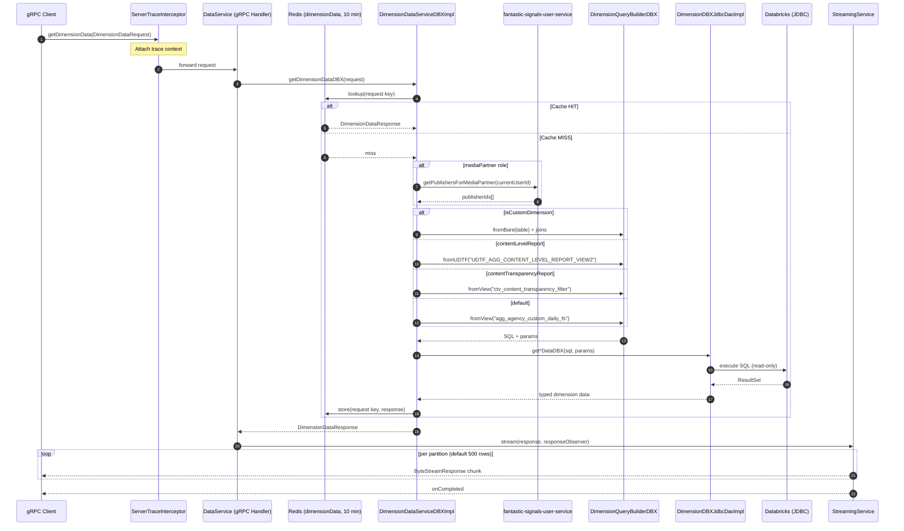

# DataService/getDimensionData — Complete Flow

## 1. Overall Flow Summary

`getDimensionData` is a **server-streaming gRPC method** on `DataService`. It accepts a `DimensionDataRequest` (date range, team IDs, dimension, metrics, filters, report type, user context) and streams back serialized protobuf data chunked as `ByteStreamResponse` messages.

The request flows: gRPC handler → a cached Databricks service layer → a JDBC DAO that executes dynamically-built SQL against Databricks views/UDFs. Results are serialized and streamed in configurable partition sizes. A Redis cache (10-minute TTL) short-circuits the Databricks query on repeated identical requests. For media partner users, an upstream gRPC call to `fantastic-signals-user-service` fetches allowed publisher IDs before the query runs.

## 2. Call Chain

```
gRPC client
  │
  ▼
DataService.getDimensionData(DimensionDataRequest, StreamObserver)
  [grpc/DataService.java]
  │
  ├──► StreamingService.stream(data, responseObserver)
  │      [fantastic-signals-library:1.0.133 — chunks ByteStreamResponse]
  │
  └──► DimensionDataServiceDBXImpl.getDimensionDataDBX(request)
         @Cacheable("dimensionData") — checks Redis first
         │
         ├── [isCustomDimension] → DimensionQueryBuilderDBX (bare table + joins)
         │                       → DimensionDBXJdbcDaoImpl.getCustomDimensionDataDBX
         │
         └── [standard dimension]
               ├── contentLevelReport → fromUDTF("UDTF_AGG_CONTENT_LEVEL_REPORT_VIEW2")
               ├── contentTransparencyReport → fromView("ctv_content_transparency_filter")
               └── default perf report → fromView("agg_agency_custom_daily_fs")
                     [mediaPartner role] → UserServiceClient.getPublishersForMediaPartner()
               └── DimensionDBXJdbcDaoImpl.get{Campaign|Publisher|Placement|AdSize|DspDeal}DataDBX
```

## 3. DB Tables Touched (all READ-ONLY, Databricks JDBC)

| Table / View / UDTF | Used When |
|---|---|
| `reportingplatform_env.external_aggs.agg_agency_custom_daily_fs` | Default performance reports |
| `reportingplatform_env.LOOKER_SCRATCH.UDTF_AGG_CONTENT_LEVEL_REPORT_VIEW2` | `reportType = contentLevelReport` |
| `reportingplatform_env.prog_reporting.ctv_content_transparency_filter` | `reportType = contentTransparencyReport` |
| `reportingplatform_env.external_aggs.agg_agency_custom_daily_fs` (bare + joins) | Custom dimensions |
| `reportingplatform_env.silver.publisher` | Custom dimension JOIN |
| `reportingplatform_env.silver.placement` | Custom dimension JOIN |

## 4. External Dependencies

- **fantastic-signals-user-service** (gRPC, blocking) — called only for media partner roles to get allowed publisher IDs.
- **Databricks** (JDBC, read-only) — primary data store, HikariCP max 50 connections
- **Redis** — cache name `dimensionData`, TTL 10 min; fallback to EhCache (360 min / 64 MB off-heap)
- **fantastic-signals-library v1.0.133** — streaming/chunking infrastructure and `ServerTraceInterceptor`

## 5. Auth / Middleware

- **`ServerTraceInterceptor`** (`@GrpcGlobalServerInterceptor`) — tracing/Micrometer, all environments
- **`LoggingInterceptor`** — response-size logging, `local`/`dev` profiles only
- **`GrpcExceptionAdvice`** — maps `IllegalArgumentException` → `INVALID_ARGUMENT`, `IasException` → embedded status
- **No auth at the gRPC layer** — auth is enforced upstream (API gateway / network)

## 6. Mermaid Sequence Diagram


