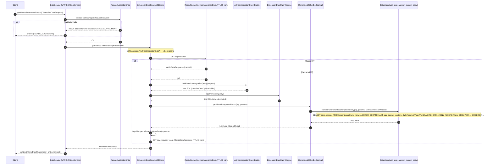

# Endpoint Flow: DataService/getMetricsDimensionReport

## Flow Summary

`getMetricsDimensionReport` is a gRPC unary RPC exposed on both `DataService` (v1, returns `MetricDataResponse`) and `DataServiceV2` (v2, returns a serialized `ByteStreamResponse` via the streaming library). The handler first validates the incoming `DimensionDataRequest` — requiring a non-null dimension, at least one team ID, and valid ISO date strings — then delegates to `DimensionDataServiceDBXImpl.getMetricsDimensionReport`. That service method is protected by a Spring `@Cacheable("metricsIntegrationData")` cache (Redis with 10-minute TTL, falling back to EhCache when Redis is unavailable). On a cache miss it uses `MetricsIntegrationQueryBuilder` to construct a parameterized SQL query invoking the Databricks UDTF `udtf_agg_agency_custom_daily` in the `reportingplatform_<env>.LOOKER_SCRATCH` schema, fires the query through a `NamedParameterJdbcTemplate` backed by the Databricks JDBC driver, maps each result row via `MetricDimensionMapper`, and returns the assembled `MetricDataResponse` to the caller.

## Call Chain

```
1. gRPC DataService/getMetricsDimensionReport   →  DataService.getMetricsDimensionReport()
                                                   [@GrpcService, extends DataServiceGrpc.DataServiceImplBase]
2. DataService                                  →  RequestValidationUtils.validateMetricsReportRequest(request)
                                                   [validates: dimension != unknown_dimension,
                                                    teamIds non-empty, startDate/endDate valid format;
                                                    throws Status.INVALID_ARGUMENT on failure]
3. DataService                                  →  DimensionDataServiceDBX.getMetricsDimensionReport(request)
                                                   [interface; impl: DimensionDataServiceDBXImpl]
4. DimensionDataServiceDBXImpl                  →  @Cacheable("metricsIntegrationData") lookup
                                                   [Cache READ: Redis (key = #request), TTL 10 min;
                                                    fallback: EhCache if Redis unreachable]
   — cache HIT  →  returns cached MetricDataResponse immediately (skips steps 5–9)
   — cache MISS →  continues
5. DimensionDataServiceDBXImpl                  →  buildMetricsIntegrationQuery(request)
                                                   [MetricsIntegrationQueryBuilder: assembles
                                                    SELECT <dimensions+metrics>
                                                    FROM reportingplatform_env.LOOKER_SCRATCH.
                                                         udtf_agg_agency_custom_daily('teamIds','start','end') AS IAS_DATA
                                                    [JOINs per dimension]
                                                    [WHERE dimension filters]
                                                    GROUP BY … ORDER BY …]
6. DimensionDataServiceDBXImpl                  →  DimensionDataQueryEngine.applyEnv(rawQuery)
                                                   [replaces "env" literal with envRead value, e.g. "dev"/"prod"]
7. DimensionDataServiceDBXImpl                  →  DimensionDBXJdbcDao.getMetricIntegrationReport(sql, params)
                                                   [impl: DimensionDBXJdbcDaoImpl]
8. DimensionDBXJdbcDaoImpl                      →  NamedParameterJdbcTemplate.query(sql, params, MetricDimensionMapper)
                                                   [DB READ: Databricks — udtf_agg_agency_custom_daily]
9. DimensionDataServiceDBXImpl                  →  GrpcMapperUtil.mapToMetricData(row) [per row]
                                                   [Map<String,Object> → MetricDataResponse.MetricData proto]
10. DataService                                 →  responseObserver.onNext(response) + onCompleted()
```

**v2 variant** (`DataServiceV2.getMetricsDimensionReport`): steps 1–9 are identical; step 10 differs — calls `StreamingService.stream(metricResponse, responseObserver)` to chunk the proto as `ByteStreamResponse` frames, then `onCompleted()`.

## DB Tables

| Table | Operation | Key Columns / Notes |
|-------|-----------|---------------------|
| `reportingplatform_<env>.LOOKER_SCRATCH.udtf_agg_agency_custom_daily` | READ | Databricks UDTF called with positional args `(teamIds, startDate, endDate)`. `<env>` substituted at runtime from `spring.datasource.databricks.envRead`. Aliased as `IAS_DATA`. |
| Dimension-specific join tables | READ | Additional LEFT/INNER JOINs appended by `DimensionEnum.getSqlJoinForDimension(dimension)` — exact tables vary by the `Dimension` enum value in the request (e.g. campaign, advertiser, placement, publisher). |

## External Dependencies

| System | Type | Details |
|--------|------|---------|
| Databricks | JDBC (SQL over HTTPS) | `NamedParameterJdbcTemplate` with `@Qualifier("databricksNamedParameterTemplate")`; driver `com.databricks.client.jdbc.Driver`; URL from `DATABRICKS_DB_URL` env var |
| Redis | Cache READ/WRITE | `@Cacheable(value = "metricsIntegrationData", key = "#request")`, TTL = 10 minutes; falls back to EhCache on `RedisConnectionFailureException` |
| UserService (gRPC) | Not called on this path | Injected into `DimensionDataQueryEngine` but `getMetricsFilterParameters` does not invoke `buildFilterParameters`, so no UserService call occurs for this RPC. |

## Auth & Middleware

- No `@PreAuthorize`, `@Secured`, or custom access-control annotations on this path.
- **`ServerTraceInterceptor`** (`@GrpcGlobalServerInterceptor`) — instruments all gRPC calls with Micrometer/OpenTelemetry tracing.
- **`LoggingInterceptor`** (`@GrpcGlobalServerInterceptor`, `@Profile({"local","dev"})`) — logs response size in MB; active in local/dev only.
- **`@Timed(value = "dimensionDataServiceDBX.getMetricsDimensionReport")`** — Micrometer timer on `DimensionDataServiceDBXImpl.getMetricsDimensionReport`.
- **Input validation** enforced inside the handler via `RequestValidationUtils.validateMetricsReportRequest()` before any service call; throws `Status.INVALID_ARGUMENT` for: `dimension == unknown_dimension`, empty `teamIds`, invalid date format.
- No mTLS, JWT, or API-key enforcement found in source. Transport-layer security is handled externally.

## Sequence Diagram



> **v2 path** (`DataServiceV2`): replace the final two steps — `StreamingService.stream(metricResponse, responseObserver)` serializes the proto into chunked `ByteStreamResponse` frames, then `onCompleted()` is called.
