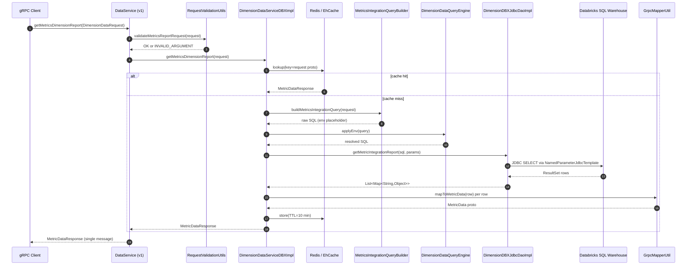

# `DataService.getMetricsDimensionReport` — Complete Flow Analysis

## 1. Overall Flow Summary

`getMetricsDimensionReport` is a gRPC endpoint exposed in two versions (`v1` and `v2`) that returns a time-windowed, dimension-sliced metrics report (impressions, viewability, fraud, etc.) from a Databricks SQL warehouse. The caller supplies a `DimensionDataRequest` carrying: a dimension (currently only `placement` is fully supported), one or more team IDs, a date range, optional standard and custom metrics, and optional dimension filters. The service validates the request, builds a parameterized SQL query against a Databricks UDTF (`udtf_agg_agency_custom_daily`), runs it via a HikariCP JDBC connection, maps the raw result set to a `MetricDataResponse` proto, and returns it. Responses are cached in Redis (primary, TTL 10 min) or EhCache (fallback, TTL 360 min) keyed on the full `DimensionDataRequest` proto.

## 2. Call Chain

### v1 — unary

```
gRPC client
  → DataService.getMetricsDimensionReport(DimensionDataRequest)
      → RequestValidationUtils.validateMetricsReportRequest(request)
      → DimensionDataServiceDBXImpl.getMetricsDimensionReport(request)
          @Cacheable("metricsIntegrationData")  @Timed(...)
          → MetricsIntegrationQueryBuilder.build(...)
              → SqlResourceLoaderUtil.getSql(...)
          → DimensionDataQueryEngine.applyEnv(query)
          → DimensionDBXJdbcDaoImpl.getMetricIntegrationReport(sql, params)
              → NamedParameterJdbcTemplate → Databricks JDBC (HikariCP)
          → GrpcMapperUtil.mapToMetricData(rows)
      → responseObserver.onNext(response) / onCompleted()
```

### v2 — streaming

Same path through `DimensionDataServiceDBXImpl`, then `StreamingService.stream(response, observer)` chunks the proto.

## 3. DB Tables Touched (all reads)

| Table / Object | Type | Purpose |
|---|---|---|
| `reportingplatform_<env>.LOOKER_SCRATCH.udtf_agg_agency_custom_daily` | Databricks UDTF | Primary fact data — impressions, viewability, fraud |
| `reportingplatform_<env>.silver.placement` | Silver dimension table | Placement name lookup (LEFT JOIN) |
| `reportingplatform_<env>.silver.publisher` | Silver dimension table | Publisher name + `MEDIA_PARTNER_ID` (LEFT JOIN) |

## 4. External Dependencies

| Dependency | Role | Notes |
|---|---|---|
| Databricks SQL Warehouse | All DB I/O | HikariCP pool, max 50 conns |
| Redis (AWS ElastiCache) | Primary cache | TTL 10 min |
| EhCache (JVM heap) | Fallback cache | TTL 360 min, 32 MB off-heap |
| fantastic-signals-user-service | Not called in this RPC | Used by other RPCs |
| Micrometer / Prometheus | Observability | Timer: `dimensionDataServiceDBX.getMetricsDimensionReport` |

## 5. Auth / Middleware

No application-level auth — no role check, no team-ownership assertion.

| Layer | Component | Detail |
|---|---|---|
| gRPC interceptor (global) | `ServerTraceInterceptor` | Distributed tracing on every call |
| gRPC interceptor (dev/local) | `LoggingInterceptor` | `@Profile({"local","dev"})` only |
| Exception mapping | `GrpcExceptionAdvice` | `IllegalArgumentException` → `INVALID_ARGUMENT`; `IasException` → its own status |
| Request validation | `RequestValidationUtils` | Validates dimension, teamIds, date format before any service call |

## 6. Mermaid Sequence Diagram


