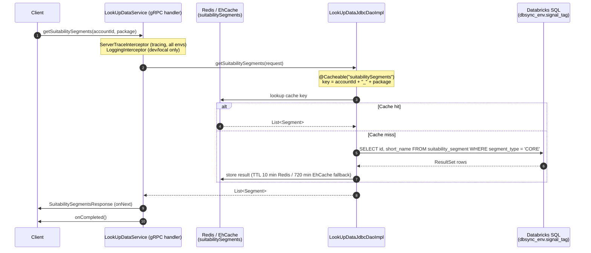

# Endpoint Flow: LookUpDataService/getSuitabilitySegments

## Flow Summary

`getSuitabilitySegments` is a gRPC RPC on the `LookUpDataService` (also reachable via HTTP GET at `/rpc/v3/data/suitabilitySegments` via the HTTP transcoding annotation in the proto). A client sends a `SuitabilitySegmentsRequest` with an optional `accountId` and `package` field. The handler in `LookUpDataService.java` logs the incoming package name and delegates directly to `LookUpDataJdbcDaoImpl`, which checks a Redis (or EhCache fallback) cache keyed on `accountId_package` before issuing a SQL query against Databricks. The query selects all rows with `segment_type = 'CORE'` from the `suitability_segment` table in the environment-specific `dbsync_<env>.signal_tag` schema. Results are mapped via `SuitabilitySegmentsMapper` to `Segment` proto objects (id + short_name) and returned as a `SuitabilitySegmentsResponse`. The call is completed normally — there is no error-handling path in the handler itself.

## Call Chain

```
1. gRPC LookUpDataService/getSuitabilitySegments  →  LookUpDataService.getSuitabilitySegments()
2. LookUpDataService                               →  LookUpDataJdbcDaoImpl.getSuitabilitySegments()    [Cache: suitabilitySegments, key=accountId_package]
3. LookUpDataJdbcDaoImpl (cache miss)              →  NamedParameterJdbcTemplate.query()               [DB READ: dbsync_<env>.signal_tag.suitability_segment]
4. NamedParameterJdbcTemplate                      →  SuitabilitySegmentsMapper.mapRow()               [maps id, short_name → Segment proto]
5. LookUpDataService                               →  StreamObserver.onNext(SuitabilitySegmentsResponse)
6. LookUpDataService                               →  StreamObserver.onCompleted()
```

## DB Tables

| Table | Operation | Key Columns / Notes |
|-------|-----------|---------------------|
| `dbsync_<env>.signal_tag.suitability_segment` | READ | `id`, `short_name`; filtered by `segment_type = 'CORE'`; `<env>` is substituted at runtime from `spring.datasource.databricks.envRead` (e.g., `dev`, `prod`) |

## External Dependencies

| System | Type | Details |
|--------|------|---------|
| Redis | Cache (read-through/write-through) | Cache name: `suitabilitySegments`; key: `accountId + "_" + package`; TTL: 10 min (Redis). Host: `nemo-redis-001.nemo-redis.q2bl8u.use1.cache.amazonaws.com:6379`, SSL enabled. Falls back to EhCache (off-heap, 1 MB, TTL 720 min) if Redis is unreachable. |
| Databricks SQL Warehouse | JDBC (`databricksNamedParameterTemplate`) | HikariCP pool `databricks-cp`, max 50 connections, idle timeout 60s. Arrow disabled (`EnableArrow=0`). |

## Auth & Middleware

- **`ServerTraceInterceptor`** (from `com.integralads.fantasticsignals.library.metrics`) — registered globally via `@GrpcGlobalServerInterceptor` in `GrpcConfig`. Integrates with Micrometer `ObservationRegistry` for distributed tracing on all gRPC calls (all environments).
- **`LoggingInterceptor`** — registered globally via `@GrpcGlobalServerInterceptor` but scoped to `@Profile({"local", "dev"})` only. Logs response payload size in MB per gRPC method. Not active in production.
- **No application-level authentication** — no `@PreAuthorize`, `@Secured`, JWT filter, API key check, or mTLS configuration was found for this endpoint. Access control is implied to be at the network/service-mesh layer.
- **gRPC server compression**: gzip enabled globally (`grpc.server.compression: gzip`).

## Sequence Diagram


