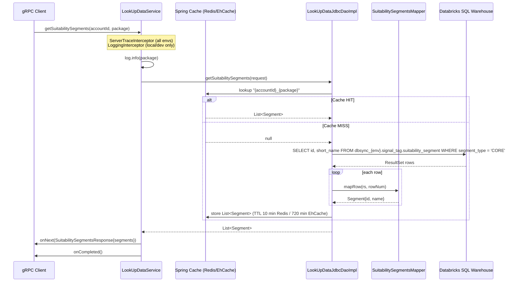

# LookUpDataService / getSuitabilitySegments — Flow Breakdown

## 1. Overall Flow Summary

`getSuitabilitySegments` is a unary gRPC RPC in the `LookUpDataService` v3 service (HTTP transcoding: `GET /rpc/v3/data/suitabilitySegments`). The Spring `@GrpcService` handler logs the incoming `package` field and delegates to `LookUpDataJdbcDaoImpl`, which checks a Spring `@Cacheable` cache (Redis primary, EhCache fallback) keyed on `accountId + '_' + package`. On a cache miss, it executes a single read-only SQL query against a Databricks SQL warehouse, maps each result row to a `Segment` proto via `SuitabilitySegmentsMapper`, wraps the list in a `SuitabilitySegmentsResponse`, and streams it back to the caller.

## 2. Call Chain

```
gRPC client
  └─► LookUpDataService.getSuitabilitySegments()
        └─► LookUpDataJdbcDao.getSuitabilitySegments()      [interface]
              └─► LookUpDataJdbcDaoImpl.getSuitabilitySegments()   [@Repository]
                    ├─► @Cacheable("suitabilitySegments")   [Redis / EhCache]
                    │     key: "{accountId}_{package}"
                    │
                    └─► NamedParameterJdbcTemplate.query(QUERY, SuitabilitySegmentsMapper)
                          └─► SuitabilitySegmentsMapper.mapRow()
```

## 3. DB Tables Touched

**Backend:** Databricks SQL Warehouse (JDBC, HikariCP, pool `databricks-cp`, maxPoolSize=50).

| Table | Columns read | Filter |
|---|---|---|
| `dbsync_{env}.signal_tag.suitability_segment` | `id` (BIGINT), `short_name` (STRING) | `segment_type = 'CORE'` |

SQL: `SELECT id, short_name FROM dbsync_{env}.signal_tag.suitability_segment WHERE segment_type = 'CORE'`

`{env}` resolved from `${DATABRICKS_ENV_READ}` (default: `dev`). No writes occur.

## 4. External Dependencies

- **Redis** (primary cache): TTL 10 min
- **EhCache** (fallback): TTL 720 min, 1 MB off-heap
- **Databricks SQL Warehouse**: sole data source; no HTTP calls, no queues, no other services called

## 5. Auth / Middleware

| Interceptor | Profile | Effect |
|---|---|---|
| `ServerTraceInterceptor` | All | Distributed tracing via Micrometer `ObservationRegistry` |
| `LoggingInterceptor` | `local`, `dev` only | Logs response size in MB |

No application-level auth interceptor found.

## 6. Mermaid Sequence Diagram


