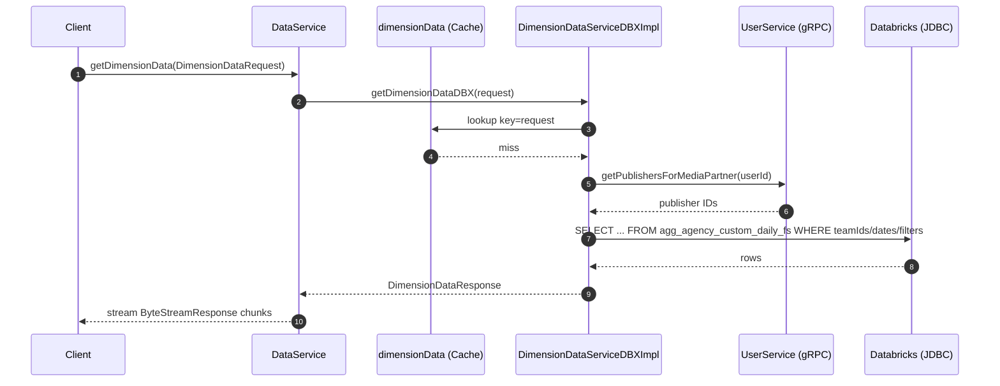

# DataService/getDimensionData

## Flow Summary

`getDimensionData` accepts a `DimensionDataRequest` (date range, teamIds, dimension, metrics, filters) and returns serialized dimension data as a server-streaming byte response. The handler delegates immediately to `DimensionDataServiceDBXImpl`, which checks a cache, builds a SQL query against a Databricks view, optionally calls UserService (gRPC) to resolve publisher IDs for media-partner users, then executes the query and streams results back as protobuf-serialized chunks via `StreamingService`.

---

## Call Chain

```
DataService.getDimensionData()                      [gRPC handler — DataServiceImplBase]
└── StreamingService.stream()                       [streams serialized DimensionDataResponse]
    └── DimensionDataServiceDBXImpl.getDimensionDataDBX()   [Cache: dimensionData, key=request]
        ├── Constants.isCustomDimension()           [branch: custom vs standard dimension]
        │
        ├── [standard path]
        │   └── DimensionDataQueryEngine.buildDimensionDataResponse()
        │       ├── DimensionDataQueryEngine.buildFilterParameters()
        │       │   └── UserServiceClientImpl.getPublishersForMediaPartner()  [gRPC: UserService/getPublishersForMediaPartner — media-partner role only]
        │       └── DimensionDBXJdbcDaoImpl.get<Dimension>DataDBX()          [DB READ: agg_agency_custom_daily_fs]
        │
        └── [custom dimension path]
            └── DimensionDBXJdbcDaoImpl.getCustomDimensionDataDBX()          [DB READ: agg_agency_custom_daily_fs]
```

---

## DB Tables

| Table | Operation | Notes |
|-------|-----------|-------|
| `agg_agency_custom_daily_fs` (Databricks view) | READ | Default performance path; filtered by `teamIds`, `startDate`, `endDate`, optional dimension filters |
| `UDTF_AGG_CONTENT_LEVEL_REPORT_VIEW2` | READ | Used when `reportType = contentLevelReport` |
| `ctv_content_transparency_filter` | READ | Used when `reportType = contentTransparencyReport` |

---

## External Dependencies

| System | Type | Details |
|--------|------|---------|
| UserService | gRPC | `getPublishersForMediaPartner` — called only when caller has `ROLE_MEDIA_PARTNER_ADMIN` or `ROLE_REPORT_BUILDER`; resolves publisher IDs added as a SQL filter |

---

## Auth & Middleware

- `ServerTraceInterceptor` (global) — Micrometer observation tracing on every gRPC call; no access-control effect.
- Role check inside `DimensionDataQueryEngine.hasMediaPartnerRole()` — gates publisher-ID lookup and controls whether publisher-dimension results are returned.

---

## Sequence Diagram


