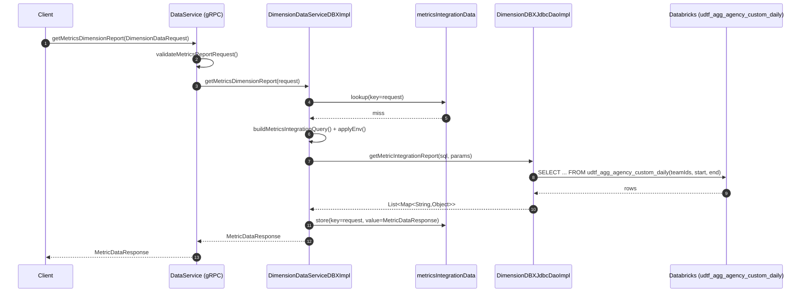

# DataService/getMetricsDimensionReport

## Flow Summary

`getMetricsDimensionReport` is a gRPC RPC (available in both `DataService` v1 and `DataServiceV2`) that accepts a `DimensionDataRequest` and returns aggregated metrics data broken down by a requested dimension. It validates the request (dimension, teamIds, date range), builds a parameterized SQL query against a Databricks UDTF, and returns the result set as `MetricDataResponse`. Results are cached in `metricsIntegrationData` to avoid redundant DB round-trips. The v2 variant streams the response back via `ByteStreamResponse` instead of returning it as a single proto message.

---

## Call Chain

```
DataService.getMetricsDimensionReport()  [gRPC: DataService/getMetricsDimensionReport]
├── RequestValidationUtils.validateMetricsReportRequest()
└── DimensionDataServiceDBXImpl.getMetricsDimensionReport()   [Cache: metricsIntegrationData, key=#request]
    ├── DimensionDataQueryEngine.applyEnv()
    ├── MetricsIntegrationQueryBuilder.build()                 [builds SQL against udtf_agg_agency_custom_daily]
    └── DimensionDBXJdbcDaoImpl.getMetricIntegrationReport()  [DB READ: udtf_agg_agency_custom_daily (Databricks)]
        └── MetricDimensionMapper.mapRow()
            └── GrpcMapperUtil.mapToMetricData()
```

**DataServiceV2** follows the identical path, then passes the `MetricDataResponse` through `StreamingService.stream()` before completing the observer.

---

## DB Tables

| Table | Operation | Notes |
|-------|-----------|-------|
| `udtf_agg_agency_custom_daily` | READ | Called as a UDTF: `FROM reportingplatform_<env>.LOOKER_SCRATCH.udtf_agg_agency_custom_daily('<teamIds>', '<startDate>', '<endDate>')`. Dimension joins and optional `WHERE` filters applied on top. |

---

## External Dependencies

None — all data is read from Databricks via JDBC. No outbound gRPC calls, no message queues.

---

## Auth & Middleware

- `ServerTraceInterceptor` (global) — Micrometer/Observation instrumentation on all gRPC methods; adds distributed tracing spans.
- `@Timed("dimensionDataServiceDBX.getMetricsDimensionReport")` on the service method — records latency as a Micrometer timer metric.

---

## Sequence Diagram


