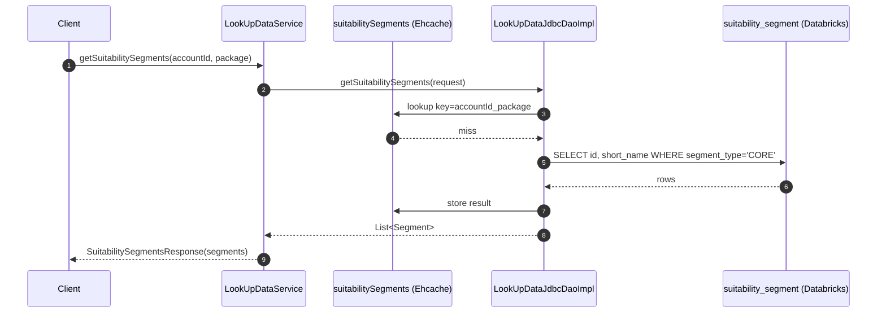

# LookUpDataService/getSuitabilitySegments

## Flow Summary

`getSuitabilitySegments` is a unary gRPC method that returns all core suitability segments (id + name) for a given account and package. It queries a single Databricks table via JDBC, with results cached in Ehcache for 720 minutes — making repeated calls for the same `accountId + package` key essentially free.

---

## Call Chain

```
LookUpDataService.getSuitabilitySegments()     [gRPC: LookUpDataService/getSuitabilitySegments]
└── LookUpDataJdbcDaoImpl.getSuitabilitySegments()
    ├── @Cacheable check                        [Cache: suitabilitySegments, key=accountId_package]
    └── NamedParameterJdbcTemplate.query()      [DB READ: suitability_segment]
        └── SuitabilitySegmentsMapper.mapRow()
```

---

## DB Tables

| Table | Operation | Notes |
|-------|-----------|-------|
| `dbsync_<env>.signal_tag.suitability_segment` | READ | `WHERE segment_type = 'CORE'`; no per-request filter — returns all core segments |

---

## External Dependencies

| System | Type | Details |
|--------|------|---------|
| suitabilitySegments | Ehcache (off-heap) | Key: `accountId + '_' + package`; TTL 720 min; 1 MB off-heap |

> Note: `application.yaml` configures Redis as the default Spring cache type, but `EhCacheConfig` registers a `JCacheCacheManager` backed by `ehcache.xml`. The `suitabilitySegments` cache is defined only in `ehcache.xml`, so it resolves to Ehcache.

---

## Auth & Middleware

- **ServerTraceInterceptor** (`GrpcGlobalServerInterceptor`) — observability/tracing on all methods via `GrpcConfig`; no auth enforcement at the gRPC layer.
- **LoggingInterceptor** — logs response payload size; active only in `local` and `dev` profiles.

---

## Sequence Diagram


