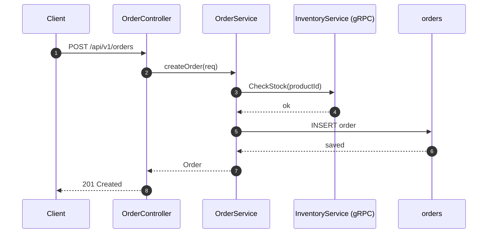

# Endpoint Flow Tracer

Given an endpoint path or gRPC method, produce a concise, scannable breakdown of how a request
flows through the system. Aim for clarity over completeness — the reader wants a quick mental model,
not an audit.

---

## Step 1: Locate the entry point

**For REST endpoints** — search for the path string in controller/resource classes:
- Look for `@RequestMapping`, `@GetMapping`, `@PostMapping`, `@PutMapping`, `@DeleteMapping`, `@PatchMapping`.
- Also check `RouterFunction` beans (functional-style routing).

**For gRPC endpoints** — search for the service/method name:
- Look for classes extending `<ServiceName>Grpc.<ServiceName>ImplBase`.
- Find the method override matching the RPC name.

Start broad: `grep -r` for the path or method name across `src/main/java`. Narrow from there.

---

## Step 2: Trace the call chain

From the entry point, follow method calls until you hit a DB call, external service call, cache, or
message producer. Read the actual source files — don't guess method bodies.

Spring patterns to watch for: `@Cacheable` (cache before DB), `@Transactional` (transaction boundary),
`@Async` (detached thread), outbound stubs or `RestTemplate`/`WebClient` (external calls).

---

## Step 3: Identify DB interactions and external dependencies

For each DAO/repository: read the SQL or Spring Data method name, note the table and operation type.

For external calls: note the system, what operation, and any topic/queue/cache key.

---

## Step 4: Produce the output

Keep each section tight. If a section has nothing, write "None" — don't omit it.

---

### Flow Summary

2–3 sentences. What the endpoint does and the main path it takes. Write for someone who's never
seen this service.

---

### Call Chain

An indented tree showing the call hierarchy. This format is easier to scan than a flat numbered list.
Annotate leaves with what they touch.

```
EntryPoint (ClassName)
└── ServiceClass.methodName()
    ├── CacheCheck                     [Cache: cacheName, key=x]
    ├── ExternalClient.call()          [gRPC: OtherService/Method]
    └── DaoClass.query()               [DB READ: table_name]
        └── ResponseMapper.map()
```

Rules:
- Show class name + method name at each node
- Annotate only the boundary hops (DB, cache, external) — not internal utilities
- Use `├──` for non-last siblings, `└──` for last child
- Keep depth to what's meaningful — don't go deeper than the DAO layer unless there's something
  surprising inside it

---

### DB Tables

| Table | Operation | Notes |
|-------|-----------|-------|
| table_name | READ | Key filter columns, e.g. `WHERE id = :id` |

Keep Notes short — one clause, not a full description.

---

### External Dependencies

| System | Type | Details |
|--------|------|---------|
| ServiceName | gRPC | MethodName — when/why called |
| cache-name | Redis | Key pattern, TTL |

---

### Auth & Middleware

One or two bullets max. Only mention interceptors that are specific to this endpoint or meaningfully
affect the flow (e.g. role check, rate limit). Skip generic tracing/logging interceptors unless
they're the only thing here.

---

### Sequence Diagram

**Keep it simple.** Show the happy path only. Max 6–7 participants. Skip `alt/opt` blocks unless the
branching is the whole point of the question (e.g. "what's the cache miss path?").

Use `autonumber`. Use short participant aliases.



If there's a cache, show it as a single participant and model only the miss path (the happy path
for a read-through cache). Don't nest `alt Cache HIT / Cache MISS` — it makes the diagram twice as
tall for information the reader can infer from the DB Tables section.

---

## Tips for hard cases

- **Path variables** — if `/api/v1/orders/{id}` yields no results, search for `/orders/` instead.
- **Abstract base classes** — find the concrete subclass; the abstract method body is a dead end.
- **Dynamic proxies** — Spring wraps `@Transactional` beans; the real logic is in the unwrapped class.
- **Proto-generated stubs** — the handler you want is the `@Override` in the `ImplBase` subclass.
